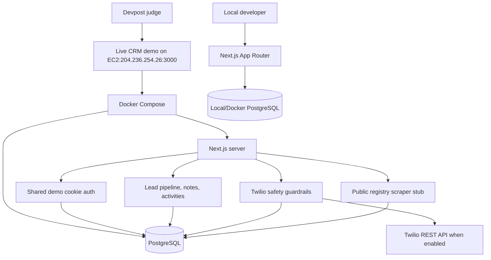

# CodexCRM

CodexCRM is a hackathon SDR workspace for OpenAI Build Week's **Work and productivity** track. It gives sales teams a small CRM with lead tracking, notes, demo-safe Twilio outreach controls, sample data, and an AWS-hosted judge demo.

## Open the live demo in under 1 minute

- Live demo: <http://204.236.254.26:3000/>
- Email: `demo@codexcrm.local`
- Password: `codexcrm-demo`

The hosted demo runs on AWS EC2 using Docker Compose with Postgres and the Next.js app. Twilio kill switches are off by default unless explicitly enabled for a controlled demo.

## Features

- Demo-only cookie authentication with no public signup.
- Leads list, lead detail, status changes, notes, and timeline activity.
- PostgreSQL persistence for users, leads, activities, messages, calls, scrape runs, and Twilio cooldown timestamps.
- Twilio SMS and outbound calls with server-side safeguards:
  - `TWILIO_ENABLED`, `SMS_ENABLED`, and `CALLS_ENABLED` kill switches.
  - US-only `+1XXXXXXXXXX` E.164 destination enforcement.
  - One outbound SMS per hour and one outbound call per hour for the shared demo scope.
  - Prohibited-content filter for drugs, weapons, fraud/phishing, hate, adult/sexual content, harassment, credential/code fishing, and spam patterns.
  - All blocked and attempted messages/calls logged to PostgreSQL.
- Seed sample leads so judges do not need live scraping.
- Limited public registry scrape stub that verifies FDACS `robots.txt`, waits between requests, caps imports, and records scrape runs.

## Local setup

### Fast path: Docker Postgres + local Next.js

Start Postgres with one command:

```bash
docker run --name codexcrm-postgres --rm -e POSTGRES_DB=codexcrm -e POSTGRES_USER=postgres -e POSTGRES_PASSWORD=postgres -p 5432:5432 postgres:16-alpine
```

In a second terminal:

```bash
cp .env.example .env
npm ci
npm run db:setup
npm run db:seed
npm run dev
```

Open <http://localhost:3000> and log in with the shared demo account above.

### Full Docker Compose path

```bash
docker compose up --build
```

Compose starts Postgres, builds the app image, initializes the schema, seeds sample data, and serves the CRM at <http://localhost:3000>.

## Environment variables

Copy `.env.example` to `.env` for local development. Important values:

- `DATABASE_URL`: PostgreSQL connection string.
- `APP_BASE_URL`: Optional public base URL for redirects, for example `http://204.236.254.26:3000` or `https://your-domain.example`.
- `COOKIE_SECURE`: Set `true` for HTTPS deployments. Leave `false` for the HTTP judge demo.
- `DEMO_EMAIL`, `DEMO_PASSWORD`, `DEMO_SESSION_SECRET`: Shared demo login and signed demo session value.
- `TWILIO_ENABLED`, `SMS_ENABLED`, `CALLS_ENABLED`: Kill switches. Keep disabled unless running a controlled Twilio demo.

Do **not** commit `.env`, `.env.aws`, PEM files, Twilio tokens, AWS keys, or production database credentials.

## Architecture



## AWS deployment

See [`docs/AWS_DEPLOY.md`](docs/AWS_DEPLOY.md) for the current EC2 + Docker Compose deployment path used by the live demo. The guide also notes an optional AWS App Runner path for a future managed HTTPS deployment.

## How Codex and GPT-5.6 were used

- Planned the Build Week submission checklist and converted it into concrete repo tasks for judges.
- Implemented and reviewed Next.js App Router pages, API routes, and demo authentication safeguards.
- Modeled the PostgreSQL schema and sample seed data so reviewers can run the app locally without external services.
- Added Twilio safety controls, kill-switch documentation, cooldown behavior, and no-secrets guardrails.
- Drafted AWS deployment documentation for the EC2 Docker Compose judge demo and optional managed deployment paths.
- Ran build checks and repository hygiene checks to keep the public submission reproducible.
- `/feedback` Session ID: `PASTE_FEEDBACK_ID`

## Video

Demo video placeholder: `PASTE_YOUTUBE_OR_DEVPOST_VIDEO_LINK`

## Submission checklist

See [`docs/SUBMISSION.md`](docs/SUBMISSION.md).

## License

MIT. See [`LICENSE`](LICENSE).
