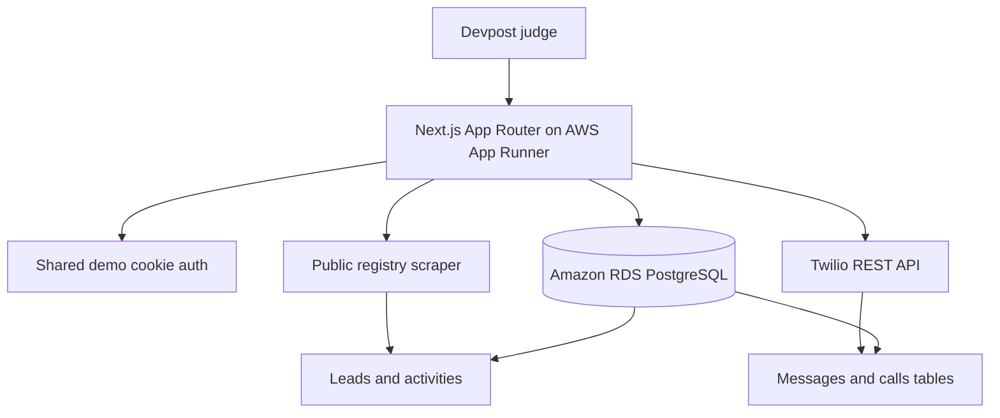

# CodexCRM

CodexCRM is a minimal SDR CRM for OpenAI Build Week's Work and productivity track. It is designed to run inside the owner's AWS account so CRM data stays in that cloud boundary.

## Demo login

Shared judge login (non-production demo only):

- Email: `demo@codexcrm.local`
- Password: `codexcrm-demo`

## Features

- Demo-only cookie authentication with no public signup.
- Leads list, lead detail, status changes, notes, and timeline activity.
- PostgreSQL persistence for users, leads, activities, messages, calls, scrape runs, and Twilio cooldown timestamps.
- Twilio SMS and outbound calls with server-side safeguards:
  - `TWILIO_ENABLED`, `SMS_ENABLED`, and `CALLS_ENABLED` kill switches.
  - US-only `+1XXXXXXXXXX` E.164 destination enforcement.
  - One outbound SMS per hour and one outbound call per hour for the shared demo scope.
  - SMS prohibited-content filter for drugs, weapons, fraud/phishing, hate, adult/sexual content, harassment, credential/code fishing, and spam patterns.
  - All blocked and attempted messages/calls logged to PostgreSQL.
- Seed sample leads so judges do not need live scraping.
- Limited public registry scrape stub that verifies FDACS `robots.txt`, waits between requests, caps imports, and records scrape runs.

## Local setup

```bash
cp .env.example .env
npm install
npm run db:setup
npm run db:seed
npm run dev
```

Open http://localhost:3000 and log in with the demo account above.

## Twilio setup

1. Buy/configure one US Twilio number.
2. Set `TWILIO_ACCOUNT_SID`, `TWILIO_AUTH_TOKEN`, and `TWILIO_FROM_NUMBER`.
3. Keep `TWILIO_ENABLED=false` until ready to demo.
4. Enable only what is needed with `SMS_ENABLED=true` and/or `CALLS_ENABLED=true`.
5. Use only opted-in/test recipients for demos.

## Scraping policy

CodexCRM v1 only targets public, non-login, non-CAPTCHA sources. It checks `robots.txt`, rate limits requests, caps each run to 25 records by default, and imports sample-safe placeholder leads for the hackathon demo. No secrets or real customer PII should be committed.

## Architecture



## AWS deployment

See [`docs/AWS_DEPLOY.md`](docs/AWS_DEPLOY.md). Recommended v1 deployment is AWS App Runner plus Amazon RDS PostgreSQL for the fastest HTTPS path with low operational burden.

## How Codex and GPT-5.6 were used

Codex and GPT-5.6 were used to scaffold the Next.js application, model the database schema, implement Twilio safety constraints, draft AWS deployment documentation, and prepare hackathon-ready README content. Feedback ID placeholder: `/feedback TODO`.

## Video

Demo video placeholder: `TODO add Devpost video link`.

## License

MIT. See [`LICENSE`](LICENSE).
